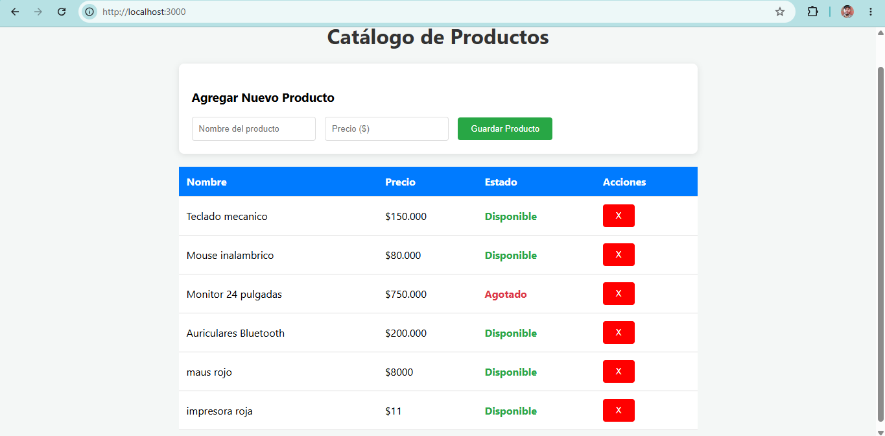

#  Proyecto API REST y Frontend - Gestión de Inventario

Este proyecto consiste en una aplicación web completa para la gestión de inventario de una tienda de tecnología. Cuenta con un **Backend** construido con Node.js y Express, y un **Frontend** dinámico construido con HTML, CSS y JavaScript utilizando la Fetch API nativa.

#  Integrantes
* **Brahian David Gómez Rivera** * **SAMUEL MOLINA:** 

---

##  Captura de Pantalla de la Interfaz
Aquí se puede apreciar la aplicación web conectada y funcionando en el navegador:



---

##  Requisitos de Instalación y Ejecución

Para ejecutar este proyecto en tu computadora local, sigue estos pasos:

1. **Clonar el repositorio:**
   ```bash
   git clone [https://github.com/brahiangomezrivera238-art/Actividad-Clase-Mayo-.git](https://github.com/brahiangomezrivera238-art/Actividad-Clase-Mayo-.git)